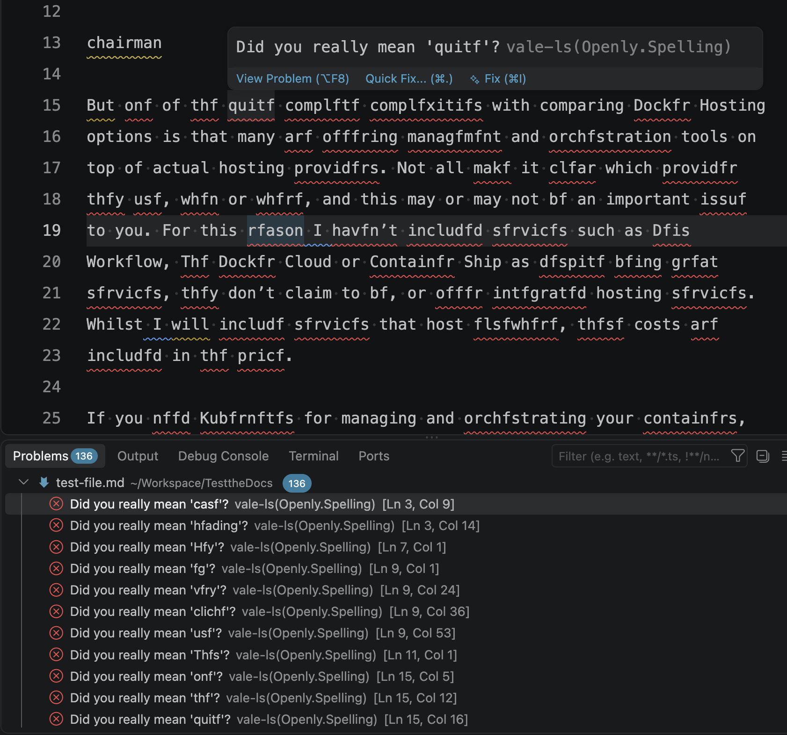
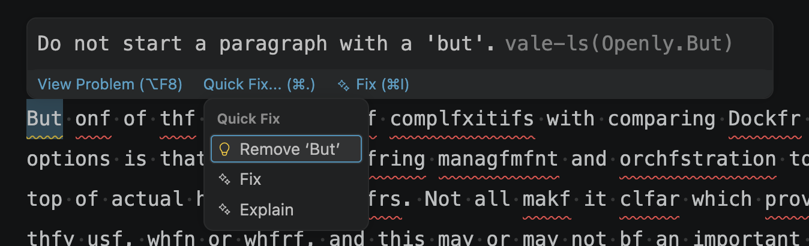
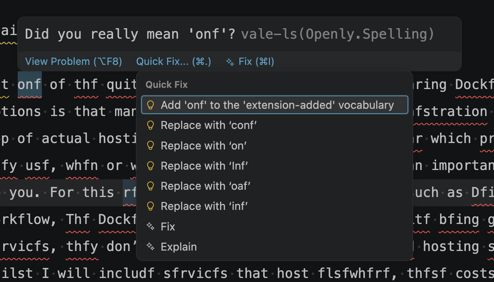
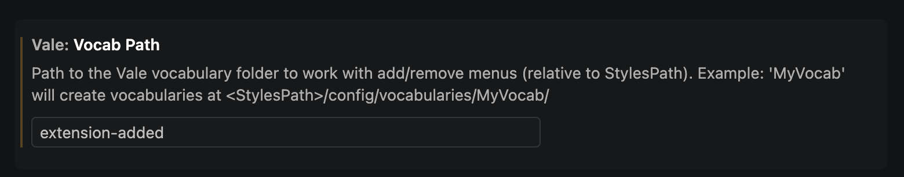

# The Vale extension for Visual Studio Code

 

> The Visual Studio Code extension for [Vale](https://vale.sh).

The Vale extension for Visual Studio Code and editors based on Visual Studio Code such as Cursor provides customizable spelling, style, and grammar checking for a variety of markup formats (Markdown, AsciiDoc, reStructuredText, HTML, and DITA). The extension uses the [Vale Language Server](https://github.com/vale-cli/vale-ls) which allows for tighter integration with Vale features.

## Requirements

- VS Code **1.109.0 or later**, or a compatible editor based on that version or later.
- Vale **3.10.0 or later**, available on the extension host's `PATH`, configured through `vale.valeCLI.path`, or installed automatically with `vale.valeCLI.installVale`. Alternatively, use [Docker](#using-vale-via-docker).
- An accessible `.vale.ini` configuration with rules enabled for the files you want to check.
- Internet access on first launch to download the Vale Language Server, and when downloading Vale or syncing packages.

## Installation

1. Install [Vale](https://vale.sh/docs/vale-cli/installation/) - **3.10.0 or later** (see note below) or use the extension's options to install Vale automatically.
2. install `vale-vscode` (this extension) via the [Marketplace](https://marketplace.visualstudio.com/items?itemName=chrischinchilla.vale-vscode).
3. Restart VS Code (recommended).

### Pre-release versions

The Marketplace receives pre-release builds ahead of stable releases. To opt in,
open the extension's Marketplace page in VS Code and choose **Switch to
Pre-Release Version**. Switch back at any time with **Switch to Release
Version**.

> [!WARNING]
> Vale versions before 3.10.0 don't support the raw filter expressions this extension sends for setting alert levels or toggling spell check, and fail every lint with `filter '...' not found`. This happens even if you never touch either setting, since spell checking defaults to `false`. If your Vale CLI version predates 3.10.0, the extension shows a warning identifying this on startup.

## First launch

On first launch the extension downloads the [Vale Language Server](https://github.com/vale-cli/vale-ls) binary, verifies it against a known SHA-256 checksum, and stores it in VS Code's per-extension global storage directory.

## Features

The extension uses any [configuration](https://vale.sh/docs/topics/config/), [vocabularies](https://vale.sh/docs/topics/vocab/), and [packages](https://vale.sh/docs/topics/packages/) defined in your [Vale configuration](https://docs.vale.sh/topics/.vale.ini). If you experience any issues with the extension, check if Vale runs as expected on the command line first.

### Highlight Vale rule violations in the editor and problems view

**Vale: Show Readability Metrics** computes a Flesch-Kincaid grade level for the active file's saved content and, since readability is document-wide rather than specific to a line, displays it where the `vale.readabilityProblemLocation` setting says to: the status bar (default), inline in the problems view, or both. It doesn't run automatically as you type or save - re-run the command to refresh it.

### Quick fixes

Fix word usage, capitalization, and more using [Quick Fixes](https://code.visualstudio.com/docs/editor/refactoring#_code-actions-quick-fixes-and-refactorings) (macOS: <kbd>cmd</kbd> + <kbd>.</kbd>, Windows/Linux: <kbd>Ctrl</kbd> + <kbd>.</kbd>).

The quick fixes feature depends on the underlying rule implementing an action that VS Code can then trigger. A [`substitution`](https://vale.sh/docs/topics/styles/#substitution) rule with multiple `|`-separated alternatives (e.g. `swap: what if|options|more`) offers one quick fix per alternative.

### Spell checking

You need a [`spelling` style](https://vale.sh/docs/topics/styles/#spelling) in your Vale configuration to enable spell-checking.

With no additional Vale configuration, the spell checker uses a Hunspell-compatible US English dictionary. If you want to use other custom dictionaries, then configure your [`spelling` style](https://vale.sh/docs/topics/styles/#spelling) with custom dictionaries.

The extension supports adding custom exception words to [Vale exception lists](https://docs.vale.sh/keys/vocabularies). For it to work, you need to add a vocabulary path to the `vale.vocabPath` setting. The extension can then add the selected word to the vocabulary lists from the quick fix menu or by selecting the word and right-clicking.

For example, if you set `vale.vocabPath` to "MyVocab", it targets _<StylesPath>/config/vocabularies/MyVocab/>_.

### Vale commands panel

The following commands are available from the **Vale** panel in the Explorer sidebar and from the command palette (<kbd>Cmd</kbd>/<kbd>Ctrl</kbd> + <kbd>Shift</kbd> + <kbd>P</kbd>):

- **Vale: Sync** downloads and updates the packages defined in your `.vale.ini` file. You can also enable automatic syncing on startup using the `vale.valeCLI.syncOnStartup` setting (see Settings below).
- **Vale: Install or Update Vale** installs or updates the Vale binary the language server manages.
- **Vale: Show Configuration** runs `vale ls-config` and displays the active Vale configuration in the Vale output panel.
- **Vale: Show Readability Metrics** reports the active file's readability metrics.
- **Vale: Restart Language Server** retries installation if needed and restarts all workspace clients without reloading the window.
- **Vale: Show Diagnostics** shows the extension-host location, platform/libc, workspace and config paths, selected Vale execution mode, and language-server startup failures.
- **Vale: Add to Accept List** / **Vale: Add to Reject List** add the selected (or right-clicked) word to your vocabulary's `accept.txt` or `reject.txt`. They need `vale.vocabPath` set. Also available as quick fixes on spelling alerts.

### Multi-root workspaces

The extension starts a separate Vale Language Server instance per workspace folder, each scoped to that folder's files. This means:

- You can set settings such as `vale.valeCLI.config`, `vale.valeCLI.path`, and `vale.vocabPath` per folder (e.g. in each folder's `.vscode/settings.json`) and the extension resolves them relative to that folder, including `${workspaceFolder}` in `vale.valeCLI.config` and `vale.valeCLI.path`.
- Commands run from the **Vale** panel or command palette (**Vale: Sync**, **Vale: Show Configuration**, **Vale: Show Readability Metrics**, and the vocabulary commands) act on the workspace folder containing the currently active file, not always the first folder in the workspace.
- Adding or removing a folder from the workspace starts or stops its Vale Language Server instance automatically, without needing to reload the window.

Changing a setting that affects the Vale Language Server (`vale.enableSpellcheck`, `vale.valeCLI.minAlertLevel`, `vale.valeCLI.config`, `vale.valeCLI.syncOnStartup`, `vale.valeCLI.installVale`, `vale.valeCLI.path`, `vale.docker.enabled`, `vale.docker.image`, `vale.docker.extraArgs`) restarts the affected folder's server instance automatically, without needing to reload the window.

### Using Vale via Docker

Set `vale.docker.enabled` to run `vale` inside a Docker container instead of a local install. This is useful if you'd rather not install Vale (or its packages/styles) on your machine at all.

It requires Docker installed and available on your `$PATH` and a workspace folder on the local filesystem.

The extension generates a small wrapper script per workspace folder that mounts the folder onto the identical path inside the container and runs `docker run --rm -v <folder>:<folder> -w <folder> <image> ...`. The default `jdkato/vale` image the extension sets `vale` as its entrypoint, so its arguments go straight after the image name.

While Docker mode is enabled, the extension ignores `vale.valeCLI.installVale` and `vale.valeCLI.path`. If you use a custom image with a different entrypoint, add `--entrypoint=vale` (or whatever your image needs) to `vale.docker.extraArgs`.

- `vale.docker.image` (default: `jdkato/vale`): the image to run.
- `vale.docker.extraArgs`: extra arguments spliced into `docker run` before the image name, e.g. an additional `-v` mount for a styles directory that lives outside the workspace.

> [!NOTE]
> On Windows, the extension ships native x64 and ARM64 proxy executables because vale-ls cannot invoke a batch-file wrapper. The proxy mounts the Windows workspace at `/workspace` in the Linux container, translates command arguments and JSON output paths in both directions, and invokes `docker.exe` without a shell. Unsupported Windows architectures fall back to `vale.valeCLI.path`, or `vale` on `PATH`, with a warning.

### Workspace Trust

The extension supports [Workspace Trust](https://code.visualstudio.com/docs/editing/workspace-trust) in Restricted Mode ("limited" support), linting and highlighting keep working with the following caveats:

- `vale.valeCLI.path`, `vale.valeCLI.config`, `vale.valeCLI.syncOnStartup`, and all `vale.docker.*` settings are locked to their user-level value. Workspace-level overrides (e.g. in `.vscode/settings.json`) are ignored until you trust the workspace.
- **Vale: Sync**, **Vale: Show Configuration**, **Vale: Show Readability Metrics**, and the vocabulary add commands are disabled until you trust the workspace, since they run the Vale executable directly.

Trusting the workspace restores the normal settings and re-enables these commands immediately, with no window reload needed.

### Devcontainers and remote workspaces

The extension runs in VS Code's workspace extension host, so paths in `vale.valeCLI.path` and `vale.valeCLI.config` must be valid inside the devcontainer, WSL distribution, SSH host, or Codespace—not only on the local machine. An interactive shell's `PATH` can differ from the extension host's environment. Configure an absolute `vale.valeCLI.path` when in doubt.

Use **Vale: Show Diagnostics** to see the extension-host location, platform/libc, workspace and config paths, selected Vale execution mode, and language-server startup failures. **Vale: Restart Language Server** retries installation if needed and restarts all workspace clients without reloading the window.

## Troubleshooting

If no problems appear, work through these checks:

1. **Save the file.** Linting runs on save by default. Enable `vale.valeCLI.lintOnChange` to lint as you type. You still need to save new files first.
2. **Check the active configuration.** Run **Vale: Show Configuration** from the command palette. Confirm that Vale finds your `.vale.ini` and that it enables styles for the file's extension. Set `vale.valeCLI.config` if you need to select a specific configuration.
3. **Sync packages.** If your `.vale.ini` declares packages, run **Vale: Sync** to download them. These commands require a trusted workspace.
4. **Check diagnostic settings.** Make sure `vale.valeCLI.minAlertLevel` does not hide the alerts you expect. For spelling alerts, enable `vale.enableSpellcheck` and a spelling style in your Vale configuration.
5. **Try Vale directly.** For a local Vale installation, run `vale --version` and `vale path/to/your-file.md` from the workspace folder, using the same executable and configuration as the extension. In a remote workspace, run these commands inside that environment. If the CLI also fails, resolve its installation or configuration error first.

If Vale cannot start, or the CLI works but the extension does not, run **Vale: Show Diagnostics** to inspect the executable mode, paths, and startup errors. If the extension cannot find the executable, set `vale.valeCLI.path` to its absolute path in the extension host's environment. After fixing the issue, run **Vale: Restart Language Server** to retry installation if needed and restart the clients.

If the problem persists, [open an issue](https://github.com/ChrisChinchilla/vale-vscode/issues) with your editor and extension versions, Vale version, operating system, whether you use Docker or a remote workspace, relevant diagnostic output, and a minimal configuration and sample file that reproduce it. Remove sensitive paths or content before sharing.

## Settings

The extension offers a number of settings and configuration options (_Preferences > Extensions > Vale_).

- `vale.valeCLI.installVale` (default: `false`): Install Vale automatically if not found on the system.
- `vale.valeCLI.config` (default: `null`): Absolute or relative path to a Vale configuration file. Supports `~`, `${workspaceFolder}`, `${userHome}`, and `${env:VAR}`.
- `vale.valeCLI.minAlertLevel` (default: `inherited`): Defines from which level of errors and above to display in the problems view.
- `vale.doNotShowWarningForFileToBeSavedBeforeLinting` (default: `false`): **Vale: Show Readability Metrics** reads the file from disk, so it warns and offers to save first when the active file has unsaved changes. Set to `true` to skip that dialog.
- `vale.readabilityProblemLocation` (default: `status`): Where **Vale: Show Readability Metrics** displays the Flesch-Kincaid grade level it computes: the status bar (`status`), the problems view (`inline`), or both (`both`).
- `vale.enableSpellcheck` (default: `true`): Enable in-built spell checking for any `Spelling` styles.
- `vale.vocabPath` (default: `null`): Name of the Vale vocabulary the **Add to Accept List** / **Add to Reject List** commands and quick fixes write to, resolved relative to `StylesPath` (e.g. `MyVocab` targets `<StylesPath>/config/vocabularies/MyVocab/`).
- `vale.valeCLI.syncOnStartup` (default: `false`): If you have packages in a _.vale.ini_ file, then sync them on startup.
- `vale.valeCLI.filter` (default: `null`): A raw [Vale filter](https://vale.sh/docs/filters) expression, combined with `vale.valeCLI.minAlertLevel` and `vale.enableSpellcheck`'s filters using `and`.
- `vale.valeCLI.path` (default: `null`): Absolute or relative path to the Vale binary to run, instead of the one the language server manages. Supports `~`, `${workspaceFolder}`, `${userHome}`, and `${env:VAR}`. Bare executable names (for example, `vale`) use `PATH`; paths such as `./bin/vale` resolve relative to the workspace. In Restricted Mode, workspace-relative executable paths are ignored in favor of the default Vale executable. Ignored when `vale.docker.enabled` is true.
- `vale.docker.enabled` (default: `false`): Run Vale inside a Docker container instead of a local install. See [Using Vale via Docker](#using-vale-via-docker) above.
- `vale.docker.image` (default: `jdkato/vale`): Docker image to run Vale from.
- `vale.docker.extraArgs` (default: `[]`): Extra arguments spliced into `docker run` before the image name.
- `vale.valeCLI.lintOnChange` (default: `false`): Lint as you type, rather than only when a file is saved.
- `vale.valeCLI.debounceMs` (default: `300`): How long typing has to settle before linting, in milliseconds. Only applies when `vale.valeCLI.lintOnChange` is enabled.
- `vale.valeCLI.showMetrics` (default: `false`): Show a code lens with the document's metrics (word count, reading time, and so on).

### Advanced and debugging settings

- `vale.trace.server` (default: `off`): Trace the JSON-RPC traffic between VS Code and the Vale Language Server in the output panel. Set to `messages` or `verbose` when reporting a bug.
- `vale.maxNumberOfProblems` (default: `100`): Caps the number of problems shown per file. Applied client-side (vale-ls itself has no such limit), so the file is still linted in full - only what's displayed is trimmed. Set to `0` for no limit.

## Changelog

You can find the release notes on the [GitHub Releases page](https://github.com/ChrisChinchilla/vale-vscode/releases).

## Contributing

Issues and pull requests are welcome on the [GitHub repository](https://github.com/ChrisChinchilla/vale-vscode). To work on the extension locally:

- `npm install` to install dependencies.
- `npm run watch` for incremental type-checking, or `npm run webpack-dev` to bundle in watch mode.
- Press <kbd>F5</kbd> in VS Code to launch an Extension Development Host.
- `npm test` runs the unit tests. `npm run compile` type-checks the whole extension.

## License

[MIT](LICENSE) © Chris Chinchilla and Joseph Kato.
